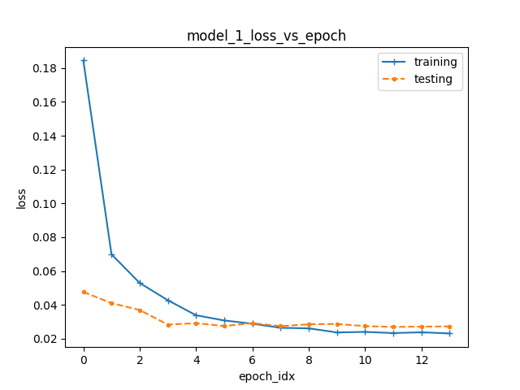
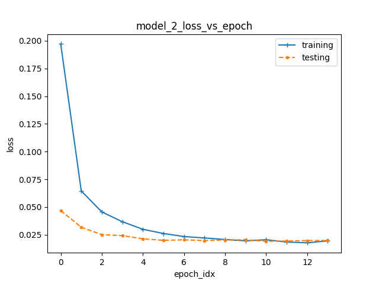
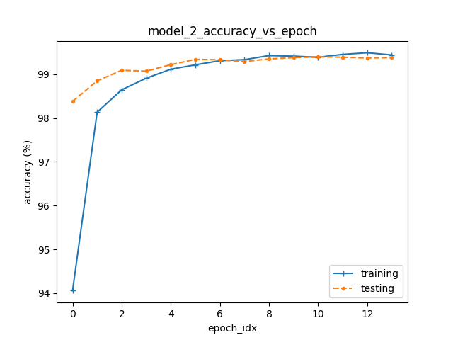
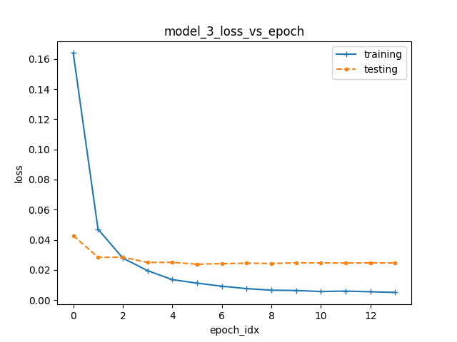

# COSD598 Warm-up Assignment Report
Name: Yi Li  
Email: yl29@princeton.edu

### Model 1 Result:
- loss vs. epoch  
  
  - training loss and testing loss are combined into one figure.
  - both loss decreases as training epoch increase
  - training loss is larger than testing epoch in the first few epoch, but smaller than testing loss after 6 epochs.  
<br/>
- accuracy vs. epoch

 

<br/>

### Model 2 Result:
#### Modification based on model-1
```python
  # add another convolution layer in the Class
  def __init__(self):
      super(Net, self).__init__()
      self.conv1 = nn.Conv2d(1, 32, 3, 1)
      self.conv2 = nn.Conv2d(32, 64, 3, 1)
  
      self.conv3 = nn.Conv2d(32, 32, 3, 1)

      self.dropout1 = nn.Dropout(0.25)
      self.dropout2 = nn.Dropout(0.5)
      # this fc layer dimension needs to be adjusted to 7744
      self.fc1 = nn.Linear(7744, 128)
      self.fc2 = nn.Linear(128, 10)
  # in the forward function, insert the new convolution layer
  # between conv1 and conv2.
  def forward(self, x):
    x = self.conv1(x)
    x = F.relu(x)
    # newly added conv layer followed by a relu layer
    x = self.conv3(x)
    x = F.relu(x)
    x = self.conv2(x)
    ......
```
- loss vs. epoch  
  
<br/>
- loss vs. epoch  
  

<br/>

### Model 3 Result:
#### Modification based on model-2
```python
  # add another linear layer
  def __init__(self):
      super(Net, self).__init__()
      self.conv1 = nn.Conv2d(1, 32, 3, 1)
      self.conv2 = nn.Conv2d(32, 64, 3, 1)
      self.dropout1 = nn.Dropout(0.25)
      self.dropout2 = nn.Dropout(0.5)
      self.fc1 = nn.Linear(9216, 1024)
      self.fc2 = nn.Linear(128, 10)
      # add a new linear layer
      # adjust the dimension of fc2
      self.fc3 = nn.Linear(1024, 128)
  def forward(self, x):
      x = self.conv1(x)
      x = F.relu(x)
      # newly added conv layer
      x = self.conv3(x)
      x = F.relu(x)
      x = self.conv2(x)
      x = F.relu(x)
      x = F.max_pool2d(x, 2)
      x = self.dropout1(x)
      x = torch.flatten(x, 1)
      x = self.fc1(x)
      x = F.relu(x)
      x = self.dropout2(x)
      # adding the fc layer here
      x = self.fc2(x)
      output = F.log_softmax(x, dim=1)
      return output
```
- loss vs. epoch  
  
<br/>
- loss vs. epoch  
  